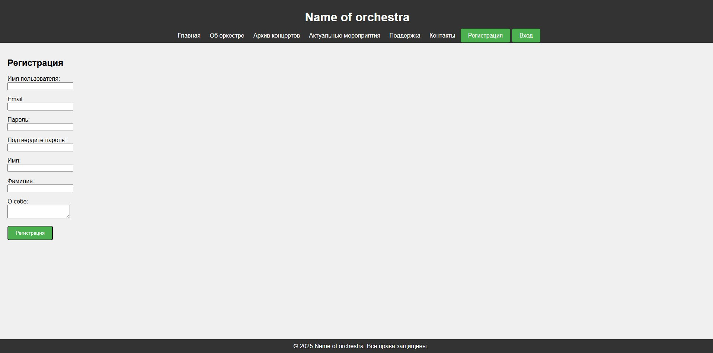
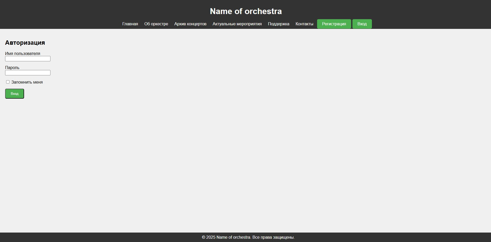
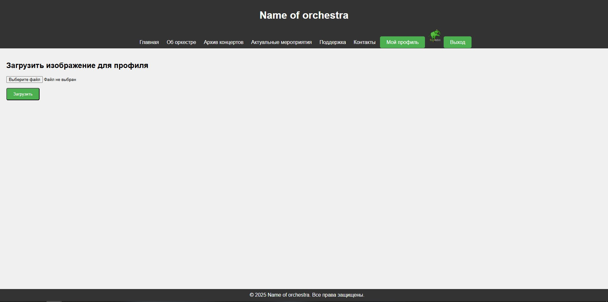
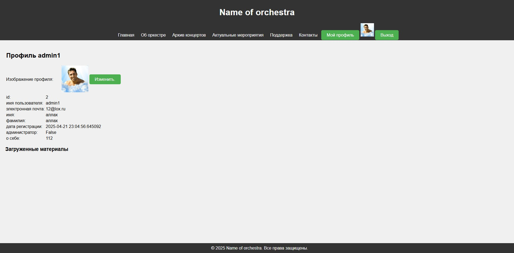
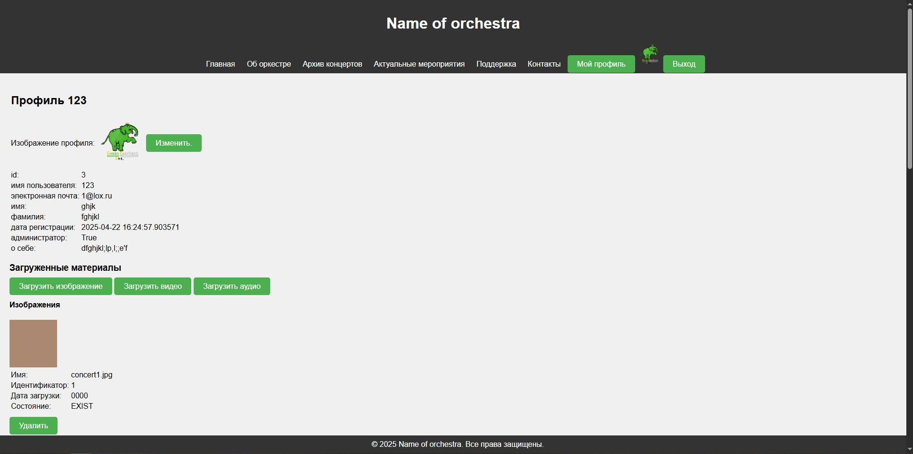
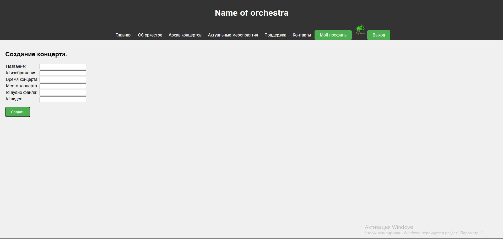
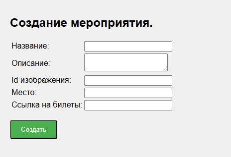
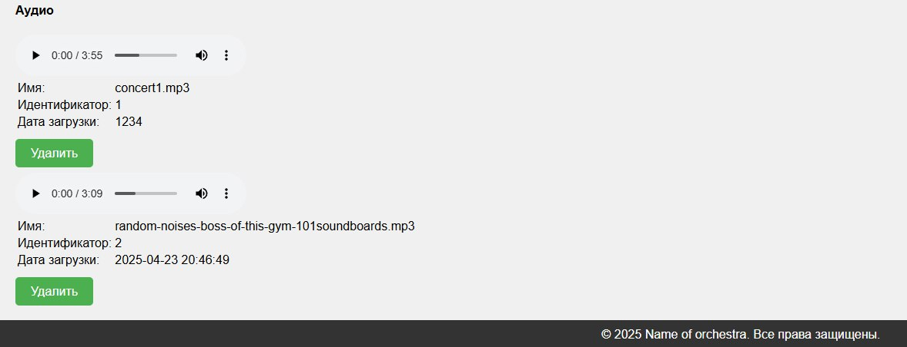
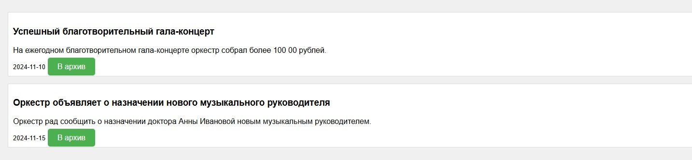

1. ### О проекте
    + Название проекта: сайт для оркестра
    + Назначение: 
        - ознакомление с информацией об оркестре
        - просмотр видеофрагментов выступлений
        - прослушивание аудиофрагментов
        - прочтение новостей/статей
        - возможность загружать любые материалы для сайта админом
        - просмотр акутальных мероприятий
    + Авторы: 
        - Тимлид: Бакланова Дарья Сергеевна
        - Разработчики: Бакланова Дарья Сергеевна, Ситников Никита Андреевич
        - Учитель: Анатольев Алексей Владимирович
    + Количество строк кода: 874
    + Ссылка на тз
2. ### Установка библиотек
   + Requirements.txt
      - Зайти в файл "requirements.txt"
      - Нажать install requirement
   + Запуск проекта
      - Зайти ва файл "main.py"
      - Нажать правую кнопку мыши
      - Выбрать run main
      - В консоли появится ссылка на сайт. Нажать на неё
3. ### Администрирование проекта

| Действие пользователя | Действие администратора                              |
|----------------------|------------------------------------------------------|
| Регистрация на сайте | Внесение в базу данных users столбца с новым id      |
| Вход на сайт         | В базе данных users в графе users is_active = True   |
| Выход пользователя   | В базе данных users в графе users is_active = False  |
| Добавление новости   | В базе данных news_arcticles появляется новая запись |
| Добавление аудио     | В базе данных audios появляется новая запись         |
| Добавление видео     | В базе данных videos появляется новая запись         | |                                                      |

4. ### Управление для пользователя
#### Для всех пользователей
1) регистрация 
- правильно заполнить все поля
- нажать кнопку "регистрация"

2) авторизация
- если пользователь регестрировался ранее
- ввести логин и пароль

3) загрузка фото профиля
- выбрать файл
- нажать кнопку "загрузить"

4) изменение фото профиля
- зайти в профиль
- нажать "изменить"
- загрузить другое фото

#### Только для админа
1) загрузка изображения/аудио/видео
- зайти в профиль
- нажать на соответствующую кнопку загрузки
- при удалении нажать "удалить"

2) создание концерта (прошедшего)
- заполнить форму
- нажать "создать"

3) создание актуального мероприятия
 - заполнить форму
 - нажать "создать"

4) удаление загруженных материалов
- нажать "удалить"

5) удаление новостей/постов
- нажать "удалить"

5. ### Ссылка на скринкаст
--
