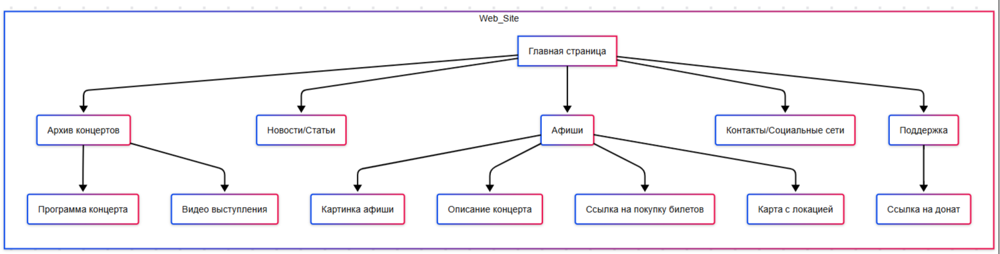
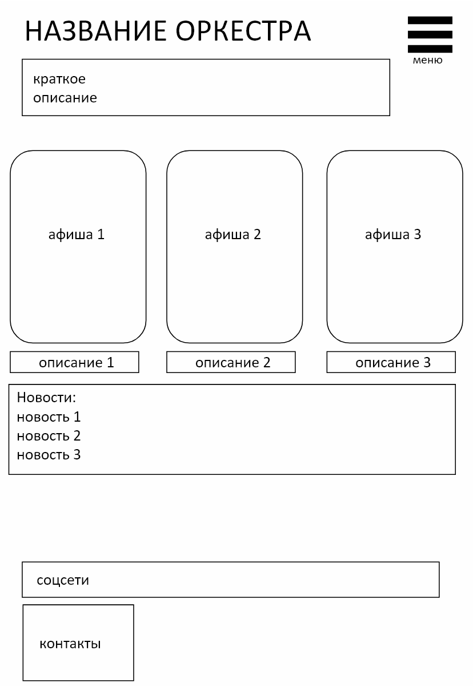
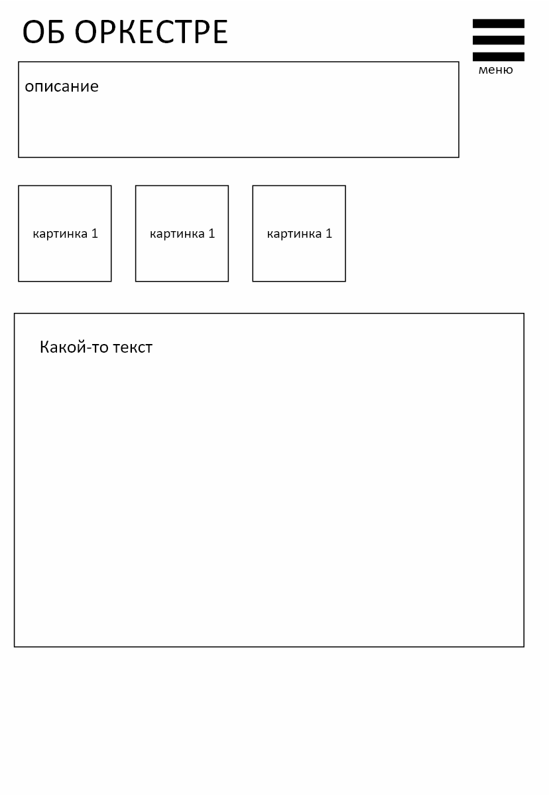
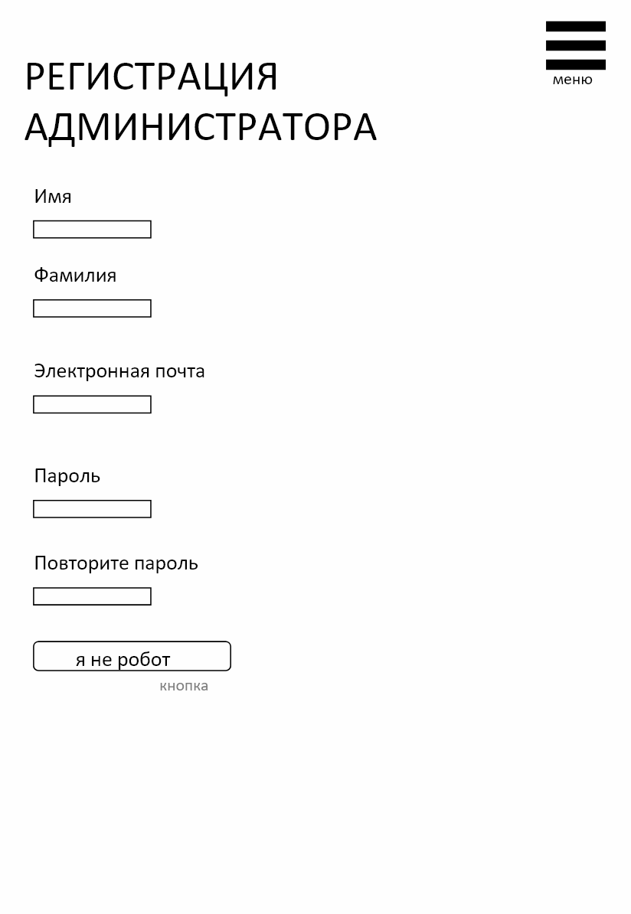
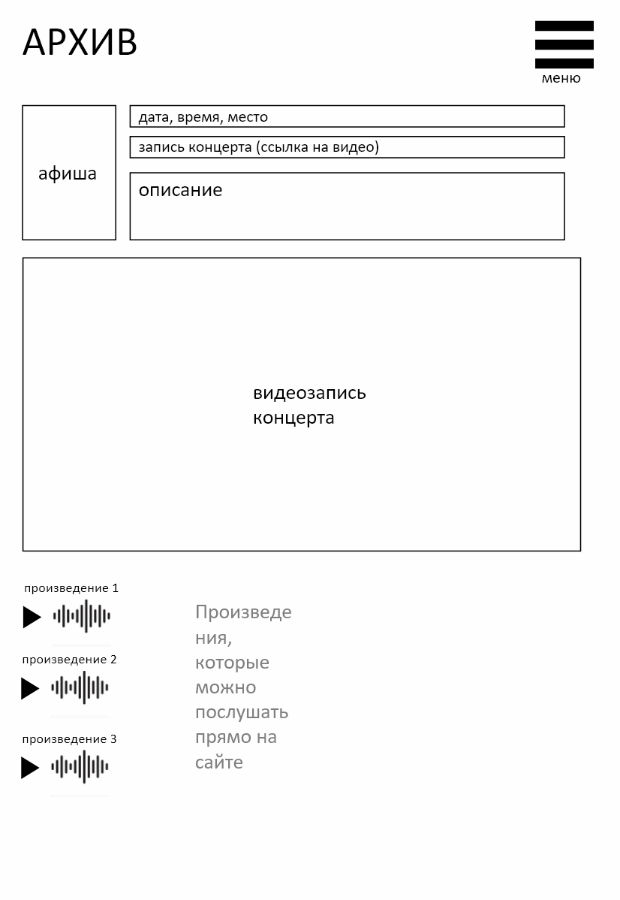
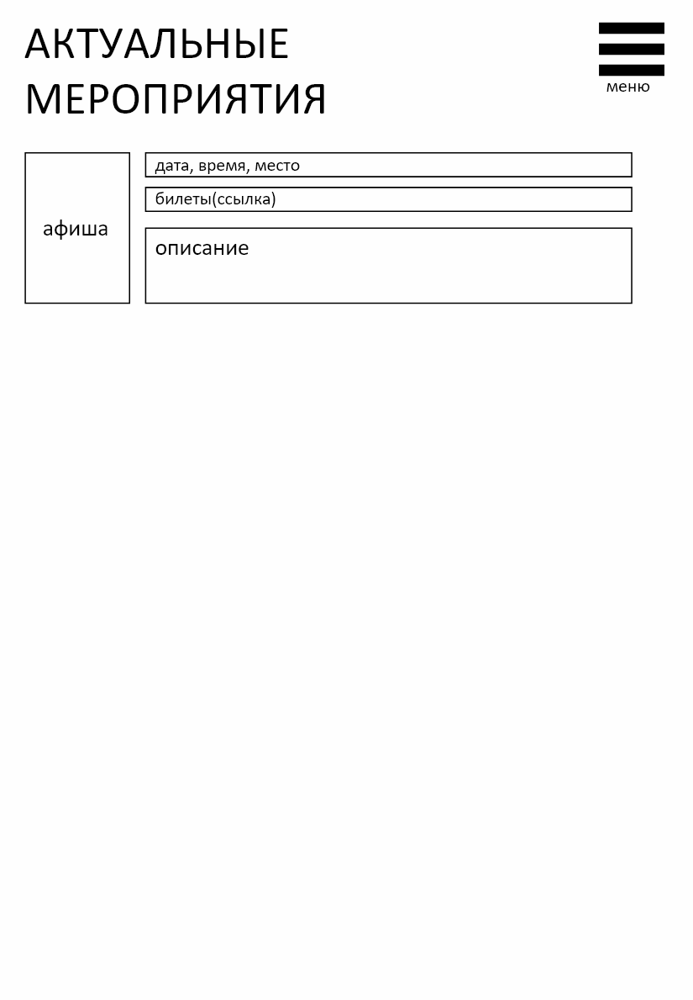
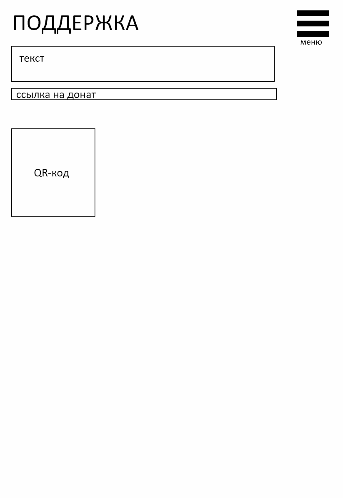

1) Название проекта: Сайт для оркестра
2) Команда проекта:
Team Lead: Бакланова Дарья Сергеевна
Разработчики: Ситников Никита Андреевич
Бакланова Дарья Сергеевна
Учитель: Анатольев Алексей Владимирович
3) 
1. Страницы сайта: 
главная (афиши, новости/статьи, поддержка, контакты/соцсети)
об оркестре
архив концертов (можно посмотреть программу, видео выступления)
афиши (картинка, описание, ссылка на покупку билетов, карта с локацией)
поддержка (ссылка на донат)
регистрация админа
2. Элементы
боковая панель
заголовки
иконки
кнопки
альбом
карусель
форма входа
3. Шаблоны
```
<!DOCTYPE html> декларация
<head> Раздел:
<meta> теги (кодировка, область просмотра и т.д.)
<title> тег (с заполнителем для определенного заголовка страницы)
CSS-ссылки (Bootstrap)
Ссылки на JavaScript (например, jQuery, пользовательские скрипты)
<body> Раздел:
<header>: Логотип веб-сайта, главное навигационное меню
<main>: <div> или <section> для размещения содержимого страницы (с помощью блока шаблона)
<footer>: Информация об авторских правах, контактная информация, ссылки на социальные сети
Шаблонные блоки:
: Для заголовка страницы (переопределяется в дочерних шаблонах)
: Куда будет вставлено основное содержимое каждой страницы.
(Необязательно) Для добавления CSS для конкретной страницы в <head>
```

4. Персональные данные
ник
электронная почта
пароль
имя, фамилия
5. Файлы пользователя
png - аватарка
6. API 
API Яндекс-карт (для отображений локаций концерта, построения маршрута(?))
7. Файлы (для работы администратора сайта)
txt - загрузка статей
mp3 - загрузка аудио
mp4 - загрузка видео
png - загрузка картинок
4) Структура проекта

5) Описание кода 
Переменные, константы: server_address, app (для создания веб-страницы), 
Функции: find_place (поиск места на карте), load_image (загрузка изображений), load_video (загрузка видео), load_mp3 (загрузка аудио), play (прослушать аудио/видео), main (запуск проекта), 
Классы: Admins, Articles, Registration, Enter, Exit  
Библиотеки: requests, json, PIL, flask, http, flask-wtf, sqlalchemy 
6) Графический интерфейc







7) Дедлайны

| Задача                             | Дедлайн         |
|------------------------------------|-----------------|
| Создание команд. Описание проекта. | 2 марта, 23:59  |
| Техническое задание                | 9 марта 23:59   |
| + Часть задания выполнена          | 16 марта 23:59  |
| + Работающая часть проекта         | 23 марта 23:59  |
| + Пояснительная записка README.md  | 30 марта 23:59  |
| + Презентация, почти всё работает  | 13 апреля 23:59 |
| Всё готово                         | 20 апреля 23:59 |
| Защита проекта                     | 24 апреля       |